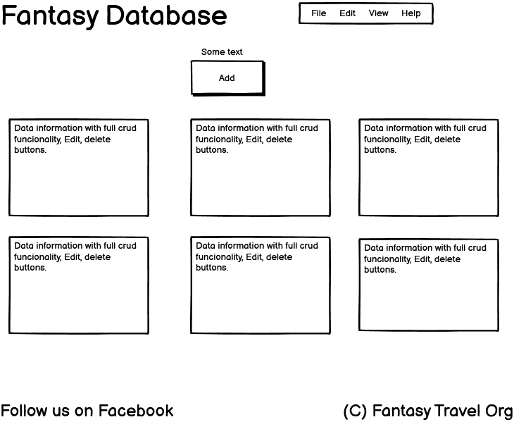
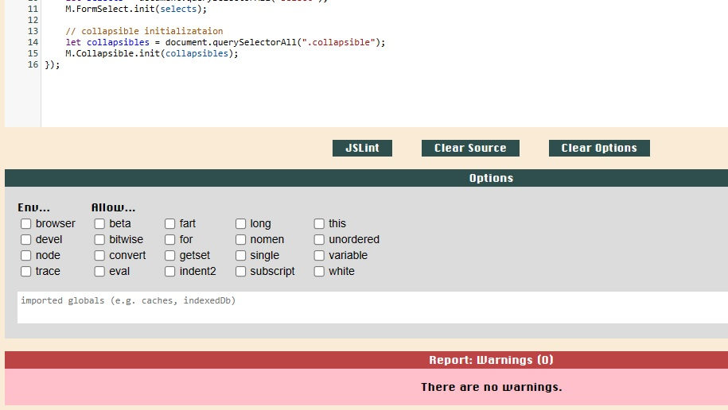
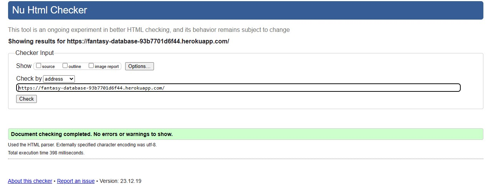
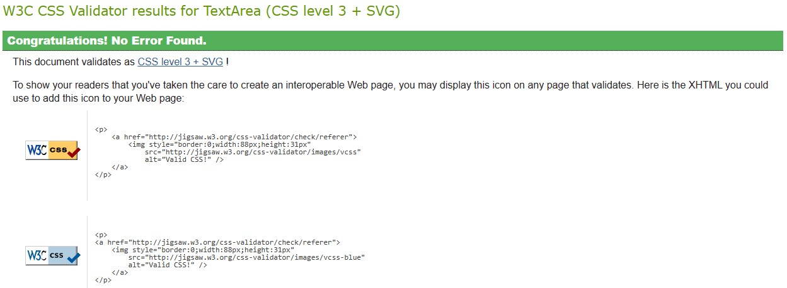

# Fantasy Travel Database
## Description
The purpose of this database is to provide information about the fantastic worlds, realms, and cities in other paradigms.
- I wanted to create this database which combines two of my passions: Travel and Fantasy.
- I built this database in order to showcase what I have learned so far through my level 5 diploma in Coding using python, PostgreSQL, and Flask.
- Troughout this project so far I have grown in confidence and feel like I can easily build a database from scratch, and also make it interactive for the user, something  I previously did not feel capable to do.
- From studying the course material and other resources on the web, I have learned lots of different ways to get the ideas from my head to the code of my database. It's been a thrilling ride!
 
## UX design

I wanted to make the user experience as easy to use but at the same time making the database unique and interesting to use. 

I created a number of HTML files in order that the finished project will be very interactive and fun to use.

The database allows for the creation, reading, updating and deletion of fantasy realms and cities. the cities are grouped according to their respective fantasy realms.

The data schema is arranged in such a way so that a user can add a fantasy realm, but also they can add a city that can be placed within a realm in order to keep the data tidy and searchable.

WireFrame

## Bugs and Testing

I Manually tested the Fantasy Database every step of the way, using the web preview function on Gitpod. I also tested it once it was deployed on Heroku to check that it was still funtioning as I had initially expected it to.

I had a problem early on where I couldn't get PostgreSQL to work on Gitpod, I searched for a long time to find otu an answer to my problem, eventually I laded on Gitpod's own page where they showed me how to write the .gitpod.yml file which downloaded and installed PostgreSQL on the IDE.

I have checked that all links are working correctly and there are no issues.

JS Lint

Below is the result on JS Lint when I enter the JS Code:

I have used a mixture of manual testing and automated testing in the creation of this database, the automated testing makes sure that it is in line with accepted standards, and the manual testing makes sure that it is comfortable for the user to use and has the correct level of interactivity.

W3 Validator

No issues found at all.

Jigsaw CSS Validation

No issues found at all.

## Deployment
My site was deployed on Heroku at https://fantasy-database-93b7701d6f44.herokuapp.com/

Help received from ElephantSQL.

Debug set to False for deployment.

## Credits
I used the Task Manager project for inspiration.

I gained a lot of help from MarketSplash.com.